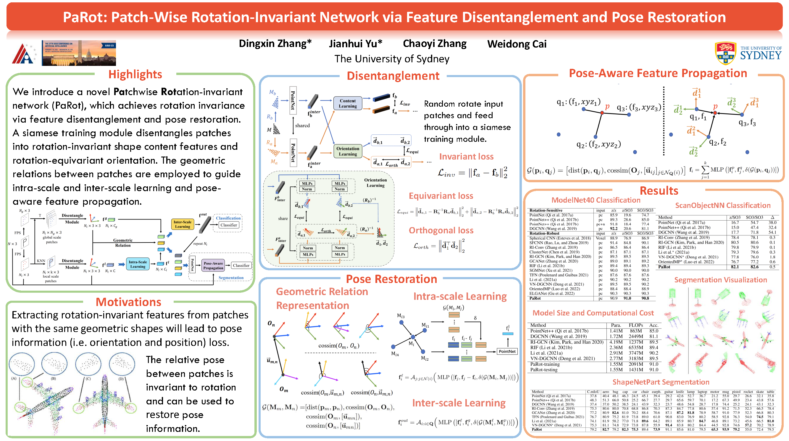

# [AAAI 2023] PaRot: Patch-Wise Rotation-Invariant Network via Feature Disentanglement and Pose Restoration

Official implementation of "PaRot: Patch-Wise Rotation-Invariant Network via Feature Disentanglement and Pose Restoration", AAAI 2023.
[[Paper]](https://patchrot.github.io/index_files/pdfs/AAAI2023_main.pdf) [[Supp.]](https://patchrot.github.io/index_files/pdfs/AAAI2023_supp.pdf) [[Video]](https://PatchRot.github.io)

We've optimized the code and released more experimental data, including class mIoU and instance mIoU, to facilitate comparisons with other methods and enable further analysis.



## Requirements

* Python 3.7
* Pytorch 1.10
* CUDA 10.2
* Packages: pytorch3d, tqdm, sklearn, visualdl, opencv-python

## Data

The ModelNet40 and ShapeNetPart dataset will be automatically downloaded. For [ScanObjectNN](https://hkust-vgd.github.io/scanobjectnn/), you need to fill out an agreement to get the download link.

## Performance
* Accuracy on **ModelNet40** under rotation: <b>91.0%</b> (z/SO(3)), <b>90.8%</b> (SO(3)/SO(3)).
* Accuracy on **ScanObjectNN** OBJ_BG classification under rotation:

| z/z | z/SO(3)  | SO(3)/SO(3) |
| :---: | :---: | :---: |
| 82.4% | 82.1% | 82.6% |

* Averaged mIoU on **ShapeNetPart segmentation** under rotation: 
 
| |z/z | z/SO(3)  | SO(3)/SO(3) |
| :--- |:---: | :---: | :---: |
| Class mIOU | 79.1% | 79.2% | 79.5% |
| Insta. mIOU | 82.8% | 82.9% | 82.8% |

## Citation  

If you find this repo useful in your work or research, please cite:  
```
@article{Zhang_Yu_Zhang_Cai_2023,
title={PaRot: Patch-Wise Rotation-Invariant Network via Feature Disentanglement and Pose Restoration},
author={Zhang, Dingxin and Yu, Jianhui and Zhang, Chaoyi and Cai, Weidong},
journal={Proceedings of the AAAI Conference on Artificial Intelligence},
volume={37}, 
number={3},
year={2023},
month={Jun.},
pages={3418-3426}
}
```
## Training Command

* For ModelNet40 model train (1024 points)
  ```
  python main_cls.py --exp_name=modelnet40_cls --train_rot=z --test_rot=so3
  ```

* For ShapeNetPart segmentation model train (2048 points)
  ```
  python main_seg.py --exp_name=shapenet_seg --train_rot=z --test_rot=so3
  ```

## Acknowledgement

Our code borrows a lot from:

- [Pointnet_Pointnet2_pytorch](https://github.com/yanx27/Pointnet_Pointnet2_pytorch)
- [DGCNN](https://github.com/WangYueFt/dgcnn)
- [DGCNN.pytorch](https://github.com/AnTao97/dgcnn.pytorch)
- [vnn-pc](https://github.com/FlyingGiraffe/vnn-pc/)
